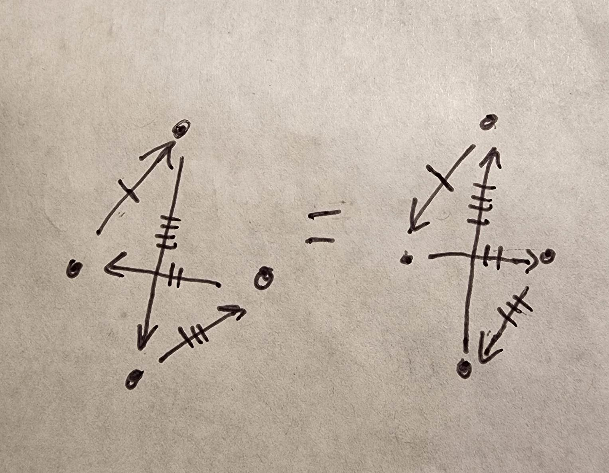
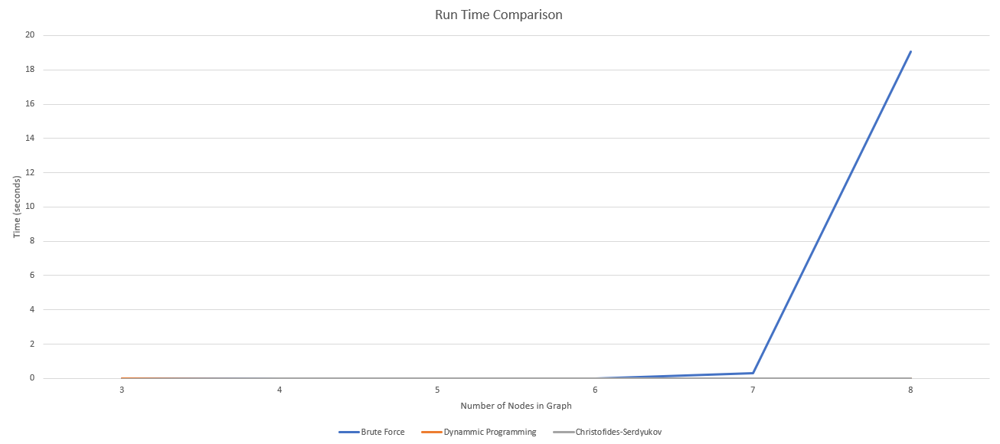

# CS5008_Research_Paper
Research Paper on Algorithms for the Travelling Salesman Problem 

## <ins>Problem Definition</ins>

The travelling salesman problem (TSP) can be stated as follows:

*"A traveling salesman wants to visit each of $n$ cities exactly once and return to his starting point. In which order should he visit these cities to travel the minimum total distance?"* <sup>1</sup>

On the surface the problem sounds very simple. However, in reality finding the optimal solution proves to be very difficult, especially as the number of cities increases. 

This problem can be defined mathematically using graphs. With the cities represented by vertices and the distances between each city represented by weighted edges. This graph can be considered to be fully connected, meaning that each vertex is connected to each other by an edge. 

Another quality of this graph is that weight of the edges represents the shortest distance between those two nodes. This is to say that there cannot exist a path with a shorter distance where an intermediate vertex is visited. This quality is also known as the triangle inequality. Mathematically this quality can be represented as $c(u,w)\leq c(u,v) + c(v,w)$ where $u,v,w$ are nodes and $c(x,y)$ is a function that returns the weight of the edge between vertex $x$ and vertex $y$. <sup>2</sup>

The condition that the salesman must return to the starting point can be defined mathematically as a tour which is a walk over a graph that has no repeated edges and starts and ends on the same vertex.

Note there are variations to this problem where certain constraints are relaxed, making the problem simpler and easier to solve. However, for the purposes of this paper the above conditions were applied.

A more rigorous mathematical formulation in the form of an integer linear program can be found in the textbook Nonlinear Programming by Dimitri Bertsekas.<sup>3</sup> 

## <ins>History and Importance of the travelling salesman problem</ins>

One of the earliest mentions of this problem could be found in a handbook for travelling through Germany and Switzerland<sup>4</sup>. However, the first mathematical formulation of the problem can be traced to the 19th century by William Rowan Hamilton and Thomas Kirkman. A more general formulation would be studied by Karl Menger in the 1930s in Vienna and Harvard.<sup>5</sup>

This problem is important in the theoretical computer science community since it is one of the problems that is proven to be NP-hard. This means that the optimal solution of this problem can be found in polynomial time but only if there exists an NP-Complete solution with polynomial time that the original problem can reduce to. In the case of the travelling salesman problem, the problem can be reduced to finding the optimal Hamiltonian cycle which is in NP Complete.<sup>6</sup>

As for the applications of this problem, the obvious application of this problem would be in optimization the path for a delivery person to take while delivering packages. These algorithms have also been used to solve optimal placement of components in printed circuit boards such that the wiring between components can be optimized.<sup>7</sup>


## Implementation and Analysis of Algorithms

<ins>Algorithms Used</ins>

In this report three algorithms were implemented. Namely, the brute force algorithm, the dynamic programming and the Christofides–Serdyukov algorithm. All three algorithms were implemented using python. Note the brute force and dynamic programming algorithms both find the optimal solution since they search the whole solution space. The Christofides-Serdyukov algorithm only provides an estimate. However, because of the accuracy trade-off the Christofides-Serdyukov algorithm is typically many times faster, depending on the implementations of the sub algorithms. This tradeoff is shown very clearly through the experiments which are shown later in the paper.

<ins>Understanding the Complexity of the problem</ins>

The difficulty can be seen through trying to solve this problem using the most naïve algorithm which the brute force method where every tour is considered.  The total possible tours can be understood by finding the number of unique permutations of ordering the nodes and then dividing by two. This is because a permutation represents the order in which the nodes can be visited and this number is divided by 2 since reversing the order will return a tour with the same cost. This is illustrated in the picture below.



*the distance is the same between arrows with the same number of marks*

Therefore, the number of possible tours can be given by the following equation, where $n$ is the number of nodes

$$Total \quad tours = \frac{(n-1)!}{2}$$

If the $n$ factorial is not convincing enough, substituting numbers shows how much the complexity increases as the number of nodes increases.

| $n$ | $\frac{(n-1)!}{2}$ |
|---|---|
| 3 | 1 |
| 4 | 3 |
| 5 | 12 |
| 6 | 60 |
| 7 | 360 |
| 8 | 2520 |
| 9 | 20160 |
| 10 | 181440 |
| 11 | 1814400 |

## Pseudo-Code

Note in all these problems the start node is assumed to be the first node. In other implementations a start node can be specified. This may help decrease the search space depending on the algorithm but technically this should not matter since each tour must visit each node. 

#### <ins>Brute Force Algorithm</ins>
The brute force method was eluded to in the previous section. The pseudo code is as follows:
```text
Algorithm: Brute Force
Input: Fully Connected Graph
Output: Minimum Tour and cost of tour

F(graph):
	# from graph obtain nodes
	nodes = graph.nodes_list
	
	# define recursive function to find permutations of all nodes
	def recursive_function(current_tour, remaining_nodes, solution)
		# Base case
		if remaining == None:
			if reversed not in solution
				Add to solution
	
		# Recursive case
		for remaining nodes:
			recursive_function(current_tour + new_node, remaining node - new_node, solution)
		
	# Initialize loop
	recursive_function(nodes[0], nodes - nodes[0], solution_list)
	
	# Parse through solution list to find minimum weight (linear time)
	return min(solution)
```

To summarize the method behind this algorithm is to find every single permutation and then find the minimum cost out of all the found solutions. The time complexity of this algorithm is $\mathcal{O}(n!)$ and the space complexity depends on how the tour is stored, if a binary representation is used then the space complexity is only $\mathcal{O}(n\log n)$. The worst case space complexity is polynomial.

#### <ins>Dynamic Programming Algorithm</ins>

In this algorithm while creating the permutations the subgraph formed by the partial tour is saved such that they don't need to be traversed again. When exploring a new node two pieces of data is required to index the memoized data: the set of visited nodes and the index of the last visited node which represents the order. From this we can calculate the space complexity, which is $\mathcal{O}(n2^{n})$. This number represents the size of the matrix need to store the number of subproblems, which in this case is the weight of the subgraphs, and the final path. This number is derived from the fact that  each tour has to visit $n$ nodes and there are $2^{n}$ possible subsets. One way to understand the $2^{n}$ is by imagining representing the subset of selected nodes as a binary numeral, where 0 denotes the unvisited nodes and 1 denotes the visited ones. This concept is important to understand as it is the basis of the implementation. 

The time complexity is $\mathcal{O}(n^{2}2^{n})$ since each subproblem takes linear time to solve. The subproblem being finding the optimal node to traverse to. To summarize this method, bit representation is used represent the subgraph which makes it easier to store the data and traverse through the graph. The memoization helps store weight data so that it does not need to be calculated again.

```text
Algorithm: Dynammic Programming
Input: Fully Connected Graph
Output: Minimum Tour and cost of tour

F(graph):
	# note start node is assumed to be the first node in list
	start = graph.nodes_list[0]
	
	# get graph lenght from adjacency matrix (or length of nodes list)
	length = size(graph.adjacency_matrix)

	# initialize 2D matrix for memoization, first dimension is number of 
	  nodes and second dimension is the binary representation of the state.
	store = matrix[length][2^length]

	# update store for first node
	update_store()
	
	# solve for the remaining graph using stored data
	solve()

	# solve for min cost using memoized data and find optimal tour
	cost = find_min_cost()
	tour = find_min_tour()

	# store starting data in matrix
	def update_store(graph, store, length)
		for i in range(node):
			if node == start: 
				continue
			# note second dimension is a binary representation
			store[i][1 << start | 1 << i] = graph.get_weights[start, node]
	
	def solve_subproblem(graph, store, length)
		# Note loop starts from 3 since first edge considers 2 nodes, so the
		  next iteration is the third node
		for r in range(3, N):
			# use another function to obtain every combination with one more
			  node than current state
			for subset in combinations(r, N):
				# skip if start is not in subset
				if start not in subset:
					continue
				# consider all nodes 	
				for next in all nodes:
					# skip of next is the start node or next is not in subset
					if next == start or next not in subset:
						continue
					# need to find best state using memoized data
					  so first take away next from subset using bit
					  manupulation, also intialize variable for min distance
					state = subset ^ (1 << next)
					min_distance = +inf
					# loop through 
					for end in all nodes:
						# skip if not under following conditions
						if end == start or end == next or end not in subset
							contine
						# calculate distance if node 'end' is added use 
						  stored data
						new_distance = store[end][next] + graph.get_weights[end, next]
						# check if need to replace min distance
						if new_distance < min_distance
							min_distance = new_distance
						
	 def combinations(r, N)
		 # This can be one using recursive function
		return every combination state from r to N

	def find_min_cost(graph, store, length)
		# note end state is always the binary representation with all ones 
		  since every node is visited
		end_state = (1 << N) - 1
		min_tour_cost = +inf
		# loop through stored array for tours with end state and find minimum
		for node in all nodes
			# skip if node is start since that entry is 0
			if node == start:
				continue
			# need to add the weight from end to start
			tour_cost = store[node][end_state] + graph.get_weights[end, start]
			# replace min_tour_cost if smaller
			if tour_cost < min_tour_cost 
				min_tour_cost = tour_cost
				
		return min_tour_cost
		
	def find_tour(graph, store, length)
		# start from initial node and end state, note these variables will change as we traverse backwards
		prev_node = graph[0]
		state = (1 << N) - 1
		# define tour to be empty array or array of size number of nodes
		tour = [] 
		for i in range(nodes list)
			# need to traverse backwards from state
			index = -1
			for j in range(nodes list)
				if j == start or j not in subgraph:
					continue
				# check if there is a better a better index than previous, if there is then use that node
				prev_dist = store[index][state] + graph.get_weights[index, prev_node]
				new_dist = store[j][state] + graph.get_weights[j, prev_node]
				if new_dist < prev_dist
					index = j
			# add to tour
			tour.append(index)
			# change state
			state = state ^ (1 << index)
			prev_node = index
				
			
		# add first node to the end since need to start and finish on first node
		tour.append(graph[0])
		return tour
```

This implementation is based off existing code by William Fisset <sup>9</sup>. However, the original code was written in java and various adaptions were made to accommodate the utility functions. Out of all the algorithms implemented, this one was the most complicated since it relies on bit manipulation to store the data and achieve a better time and space complexity than the brute force solution. 

### <ins>Christofides-Serdyukov Algorithm</ins>

This algorithm is the only approximate algorithm considered. Meaning that the solution is not necessarily optimal. However, the tradeoff for accuracy is the speed at which a good tour can be found. According to literature the error ratio, which is the minimum cost found by this algorithm divided by the true optimal cost, has an upper bound of 1.5<sup>9</sup>.  However, this also relies on the optimality of the sub algorithms involved.

This algorithm makes use of the similarity of the minimum spanning tree and the optimal tour. The minimum spanning tree (MST) is a set of edges with the minimum weight that can connect all nodes in a graph. The difference between a tree and a tour is that a tree cannot have any cycles. Therefore, if the MST was a line adding a single edge to a MST and it would become the minimum tour. However, in a lot of cases it is not that simple. The issue is that in a minimum spanning tree there maybe a lot of nodes with an odd number of edges. On the other hand, in a tour all nodes have an even number of edges since each node can only be visited once.

The Christofides-Serdyukov algorithm<sup>10</sup> solves this by first finding the minimum spanning tree, then grouping all the odd degree nodes in a subgraph. Since the original graph is fully connected, the weights between all the odd degrees are known. A minimum weight perfect matching algorithm can be applied to the subgraph. The perfect matching means that each node will have one edge but the whole graph will have an even number of edges by the handshake lemma. These edges are added back to the minimum spanning tree resulting in each node having an even degree. Note this resulting graph is a multi graph since the result from the perfect matching could include edges from the minimum spanning tree. An Eulerian tour algorithm can be applied to the graph since it has an even number of edges at each node. An Eulerian circuit is a path in which every edge is visited exactly once. However, in the TSP requires that each edge can only be used once. Therefore to convert the Eulerian circuit to a tour, the circuit is traversed and if a node has already been visited, then a new edge is created. Because the basis of the tour is a MST the total cost is generally lower and in some cases the optimal tour can be found. 

The complexity of this algorithm is derived from the implementations of the sub algorithms. Namely, the algorithm used to find the MST, the algorithm to perform the minimum weight perfect matching and the algorithm to find the Eulerian tour. However, typically the matching algorithm has the highest time complexity. For example, the blossom algorithm has a complexity of $\mathcal{O}(En^{2})$ where $E$ is the number of edges and a space complexity of $\mathcal{O}(n^{2})$.<sup>11</sup> 

```text
Algorithm: Christofides-Serdyukov
Input: Fully Connected Graph
Output: Minimum Tour and cost of tour
F(graph):
	# use function to find minimum spanning tree
	mst = mst_algorithm(graph)

	# find odd degree nodes from mst 
	odd_degree_nodes = odd_degree_function(mst)

	# using the odd_degree_nodes find the minimum perfect matching graph
	# the original graph needed for edge data
	minimum_matching_graph = minimum matching algorithm(odd_degree_nodes, graph)
	# combine minimum matching graph and mst
	combined_graph = multigraph(mst, minimum_matching_graph)

	# find Eulerian tour of combined graph
	eulerian_circuit = eulerian_tour_algorithm(combined_graph)

	# loop through circuit and skip if already in the tour
	eulerian_curcuit_nodes = eurlerian_circuit.nodes
	tour_order = [eulerian_curcuit_nodes[0]]
	for node in eulerian_circuit
		if node not in tour_order:
			tour_order.append(node)

	# use function to parse through list of nodes and find total weight and individual edges
	(tour_edges, weight) = find_edges_weights(tour_order)
```

## Summary of Algorithms

Below is a summary table of the different complexities of the three algorithms.
|  | Time<br>Complexity | Space<br>Complexity |
|---|---|---|
| Brute Force | $\mathcal{O}(n!)$ | $\mathcal{O}(n\log n)$ |
| Dynamic Programming | $\mathcal{O}(n2^{n})$ | $\mathcal{O}(n2^{n})$ |
| Christofides-Serdyukov Algorithm | $\mathcal{O}(En^{2})$ | $\mathcal{O}(n^{2})$ |

From this table, the Christofides-Serdyukov algorithm should be much faster than the dynamic programming and brute force algorithm. But the latter two are guaranteed to give optimal solutions.


## Code Implementation

#### <ins>Utility Classes</ins>

Two utility classes were created to help store facilitate the data structures. Namely a graph data structure and a priority queue data structure. The priority queue data structure was used in prim's algorithm. Due to time constraints, the built-in function heapq was used. 

```python
import heapq

class graph_class:
    def __init__(self, nodes, edges):
        """
        Initialize graph class object.
        :param nodes: List of strings that represent nodes
        :param edges: List of tuples in the format of
        (node name (string), node name (string), weight (integer))
        """
        self.nodes = nodes
        self.edges = edges
        self.adjacency_matrix = self.create_adjacency_matrix(nodes, edges)


    def create_adjacency_matrix(self, nodes, edges):
        """
        Method to create adjacency matrix
        :param nodes:
        :param edges:
        :return: 2D list representing adjacency matrix
        """
        # create empty 2D adjacency matrix
        # Note need to use for loop to create new list objects
        adjacency_matrix = [[0 for i in range(len(nodes))]
                            for i in range(len(nodes))]

        # Loop through the list of edges and assign values to 2D adjacency
        # matrix then update neighbor dictionary.
        for edge in edges:
            index_1 = nodes.index(edge[0])
            index_2 = nodes.index(edge[1])
            adjacency_matrix[index_1][index_2] = edge[2]
            adjacency_matrix[index_2][index_1] = edge[2]
        return adjacency_matrix

    def get_edge_weight(self, node_1, node_2):
        """
        Getter method for edge weight given two nodes
        :param node_1:
        :param node_2:
        :return:
        """
        return self.adjacency_matrix[self.nodes
                                   .index(node_1)][self.nodes
                                   .index(node_2)]

class priority_queue:
    def __init__(self):
        self.queue = []

    def is_empty(self):
        """
        Method to check if queue is empty
        :return: void
        """
        return len(self.queue) == 0

    def insert(self, weight, node_1, node_2):
        """
        Method to insert edges in queue.
        :param weight: weight of edge
        :param node_1: start node
        :param node_2: end node
        :return: void
        """
        heapq.heappush(self.queue, (weight, node_1, node_2))

    def dequeue(self):
        """
        Method to dequeue element with highets priority, in this case the
        lowest weight.
        :return:
        """
        return self.queue.pop(0)
        
```

#### <ins>Brute Force Algorithm</ins>

In general the code implementation follows closely to the pseudocode. This implementation was also inspired by a Leetcode solution<sup>12</sup>  but is heavily adapted for solving the traveling salesman problem. Note in this implementation the weight is calculated during the brute force process such that the optimal permutation does not have to be traversed just to find the optimal weight. 

```python
def brute_force(graph):  
    """  
    Brute Force algorithm for travelling salesman    
    :param graph: graph object from utilities    
    :return: permuations of valid tours, minimum weight  
    """    
    nodes = graph.nodes  
    permutations = []  
    weights = []  
  
    # find every permutation of nodes in graph using recursive function  
    def add_to_permutation(current, remaining, solution, current_weight,  
                           solution_weights):  
        # if no more remaining add to solution list  
        if len(remaining) == 0:  
            # if reverse already in list do not append to solution list  
            if current[::-1] not in solution:  
                current_weight += graph.get_edge_weight(current[0],  
                                                        current[-1])  
                solution.append(current)  
                solution_weights.append(current_weight)  
            return  
  
        # add a new node to current list  
        for index in range(len(remaining)):  
            add_to_permutation(current + [remaining[index]],  
                               remaining[:index]  
                               + remaining[index + 1:], solution,  
                               current_weight + graph.get_edge_weight(  
                                   current[-1], remaining[index]),  
                               solution_weights)  
  
    # start with first node and add every other node in list  
    for index in range(len(nodes)):  
        add_to_permutation([nodes[index]], nodes[:index]  
                           + nodes[index + 1:], permutations,  
                           0, weights)  
  
    return permutations, min(weights)
    
```

#### <ins>Dynamic Programming Algorithm</ins>

Similar to the brute force implementation, the implementation of the dynamic programming follows the the pseudocode closely. As stated in the previous section, the code is based off of an implementation in java<sup>8</sup>.

```python
class dynamic_programming:
    def __init__(self, graph):
        """
        Initialize object
        :param graph: graph class from utilities
        """
        self.adjacency_matrix = graph.adjacency_matrix
        self.min_tour_cost = sys.maxsize
        self.run_solver = False
        self.start_node = 0
        self.length = len(graph.adjacency_matrix)
        self.subsets = []
        self.min_tour =[]
        self.solve()


    def get_min_tour_cost(self):
        """
        Getter method for min_tour_cost
        :return: int representing min tour cost
        """
        return self.min_tour_cost

    def solve(self):
        """
        method to solve travelling salesman problem using dynamic
        programming
        :return: void
        """
        # if solver already run then just return
        if self.run_solver:
            return

        # define final state
        end_state = (1 << self.length) - 1

        # create memoization for dynamic programming
        memo = [[0 for i in range((1 << self.length))]
                for i in range(self.length)]

        # copy first row of adjacency matrix values matrix
        for i in range(1, self.length):
            memo[i][(1 << 0 | 1 << i)] = self.adjacency_matrix[0][i]

        for r in range(3, self.length + 1):
            self.combinations(r, self.length)
            # for subset in self.combinations(r, self.length):
            for subset in self.subsets:
                # if start node not in subset then skip
                if self.bit_not_in(0, subset):
                    continue
                # parse through next elements
                for next in range(1, self.length):
                    if self.bit_not_in(next, subset):
                        continue

                    subset_without_next = subset ^ (1 << next)
                    min_dist = sys.maxsize

                    for end in range(1, self.length):
                        if end == next or self.bit_not_in(end, subset):
                            continue
                        # calculate distance
                        new_distance = memo[end][subset_without_next] \
                                       + self.adjacency_matrix[end][next]

                        if new_distance < min_dist:
                            min_dist = new_distance

                    # add to memoization
                    memo[next][subset] = min_dist

        # calculate minimum cost
        for i in range(1, self.length):
            tour_cost = memo[i][end_state] + self.adjacency_matrix[i][0]
            if tour_cost < self.min_tour_cost:
                self.min_tour_cost = tour_cost

        # Using memo find optimal tour
        self.min_tour.append(0)
        prev_node = 0
        state = end_state
        for i in range(self.length - 1, 0, -1):
            optimal_node = -1
            optimal_dist = sys.maxsize
            for j in range(self.length):
                if self.bit_not_in(j, state):
                    continue
                # calculate distance
                if optimal_node == -1:
                    optimal_node = j
                prev_distance = memo[optimal_node][state] \
                                + self.adjacency_matrix[optimal_node][
                                    prev_node]
                new_distance = memo[j][state] \
                               + self.adjacency_matrix[j][prev_node]
                if new_distance < prev_distance:
                    optimal_node = j

            self.min_tour.append(optimal_node)
            state = state ^ (1 << optimal_node)
            prev_node = optimal_node

        # append first node at end since need to start and end on same node
        self.min_tour.append(0)
        self.run_solver = True


    def combinations(self, r, n):
        """
        method to call recursive function and output combinations
        :param r: current number of nodes
        :param n: total number of nodes
        :return: list of subsets represtented by binary number
        """
        self.subsets = []
        self.recursive_combinations(0, 0, r, n, self.subsets)
        return self.subsets

    def recursive_combinations(self, set, at, r, n, subsets):
        """
        Recursive function to find combinations
        :param set: current set
        :param at: current node
        :param r: number of nodes
        :param n: total number of nodes
        :param subsets: list of subsets
        :return: void
        """
        # if no more elements to add return
        if n - at < r:
            return

        # r elements selected so valid subset found, add to subset list
        if r == 0:
            self.subsets.append(set)
        #
        else:
            for i in range(at, n):
                set ^= (1 << i)

                self.recursive_combinations(set, i + 1, r - 1, n, subsets)

                set ^= (1 << i)

    def bit_not_in(self, node, subset):
        """
        Check if node is in set that is represented by binary number
        :param node:
        :param subset:
        :return:
        """
        return ((1 << node) & subset) == 0
        
```

### <ins>Christofides-Serdyukov Algorithm</ins>

The implementation for the Christofides-Serdyukov algorithm is slightly more involved than the pseudocode from the previous section due to the number of sub algorithms involved. In this code the prim's algorithm was implemented to find the minimum spanning tree. However, to find the minimum perfect matching and the Eulerian circuit the package networkx was used. This package uses the blossom algorithm<sup>13</sup> to find the maximum perfect matching graph. Note the minimum can be found by making all the weights negative and then apply a maximizing function. A linear time algorithm was used to find the Eulerian circuit.  

```python
from utilities import graph_class
from utilities import priority_queue
import networkx as nx


def prims_algorithm(graph):
    """
    Prim's Algorithm
    :param graph: graph from graph utilities
    :return: graph with mst edges
    """

    # keep set of visited nodes
    visited = []

    # initialize list to store minimum spanning tree
    mst_edges = []

    # create priority queue to store edge weights, priority queue will be
    # ordered by edge weight such that when an element is popped it will
    # have the lowest value.
    queue = priority_queue()

    # start at first node in list
    visited.append(graph.nodes[0])

    # add edges from first node to priority queue
    for index, weight in enumerate(graph.adjacency_matrix[0]):
        if weight != 0:
            queue.insert(weight, graph.nodes[0], graph.nodes[index])

    while not queue.is_empty():
        # pop minimum weight from priority queue.
        # note edge is a tuple in the form of
        # (weight, start node, end node)
        weight, start_node, end_node = queue.dequeue()

        # if end node (3rd element in tuple) is in visited then skip
        if end_node in visited:
            continue

        # visit new node and add minimum edge to the minimum spanning tree
        # note need to reformat tuple
        mst_edges.append((start_node, end_node, weight))
        visited.append(end_node)

        # add edges from new visited node if not visited
        for index, weight in enumerate(graph.adjacency_matrix[graph.nodes
                .index(end_node)]):
            if weight != 0 and graph.nodes[index] not in visited:
                queue.insert(weight, end_node, graph.nodes[index])

    # create new graph object with mst
    mst_obj = graph_class(graph.nodes, mst_edges)
    return mst_obj


def find_odd_degree(mst, graph):
    """
    Find nodes with odd degrees in a given minimum spanning tree
    :param mst: minimum spanning tree
    :param graph: Original fully connected graph
    :return:
    """
    odd_nodes = []

    for row in range(len(mst.nodes)):
        sum_degrees = 0
        for col in range(len(mst.nodes)):
            if mst.adjacency_matrix[row][col] != 0:
                sum_degrees += 1
        if sum_degrees % 2 == 1:
            odd_nodes.append(mst.nodes[row])

    # create sub graph containing only odd nodes, note still need edges
    # from original graph
    number_odd_nodes = len(odd_nodes)
    odd_edges = []

    for i in range(number_odd_nodes):
        for j in range(i + 1, number_odd_nodes):
            odd_edges.append((odd_nodes[i], odd_nodes[j], -1 *
                              graph.get_edge_weight(odd_nodes[i],
                                                    odd_nodes[j])))

    return graph_class(odd_nodes, odd_edges)


def find_minimum_matching_and_eulerian_circuit(mst, graph):
    """
    Method to find minimum matching graphs and eulerian tour.
    This method uses the package networkx.
    :param mst: minimum spanning tree
    :param graph: original fully connected graph
    :return: eurlerian tour
    """
    # create networkx graph
    odd_graph_nx = nx.Graph()
    odd_subgraph = find_odd_degree(mst, graph)
    odd_graph_nx.add_weighted_edges_from(odd_subgraph.edges)

    # odd_graph_nx.add_weighted_edges_from(graph.edges)

    matching = list(nx.max_weight_matching(odd_graph_nx,
                                           maxcardinality=True))

    # add back weight information to the odd matching subgraph
    weighted_matching = []
    for pair in matching:
        weighted_matching.append((pair[0], pair[1],
                                  graph.get_edge_weight(pair[0], pair[1])))

    # combine with original graph
    combined_graph = nx.MultiGraph()
    combined_graph.add_weighted_edges_from(mst.edges)

    combined_graph.add_weighted_edges_from(weighted_matching)

    # use networkx method to find eularian tour
    eulerian_circuit = list(nx.eulerian_circuit(combined_graph))

    return eulerian_circuit


def christofides_serdyukov_algorithm(graph):
    """
    Implementation of christofides-serdyukov algorithm
    :param graph: fully connected graph
    :return: edges of calculated tour and weight of tour
    """
    # use prim's algorithm to find mst of graph
    mst = prims_algorithm(graph)

    # find minimum matching of odd dgree nodes and eularian tour
    # note function to get odd degree nodes is called within the function
    # to find minimum matching and eulerian tour
    eulerian_circuit = find_minimum_matching_and_eulerian_circuit(mst, graph)

    # get unique node path
    tsp_tour_node_order = [eulerian_circuit[0][0]]
    for edge in eulerian_circuit:
        if edge[1] not in tsp_tour_node_order:
            tsp_tour_node_order.append(edge[1])

    # get edges and calculate total weight
    total_weight = 0
    tsp_tour_edge = []
    for index in range(len(tsp_tour_node_order)):
        node_1 = tsp_tour_node_order[index - 1]
        node_2 = tsp_tour_node_order[index]
        tsp_tour_edge.append((node_1, node_2))
        total_weight += graph.get_edge_weight(node_1, node_2)
    return tsp_tour_edge, total_weight
    
```

## Empirical Results

Test were performed on fully connected graphs with randomly generated weight values. The function used to create the graphs is shown below.

```python

def generate_graph(n):
    """
    Function to create fully connected graph object
    :param n: number of nodes in graph
    :return: graph object
    """
    # Generate nodes
    nodes = [i for i in range(n)]

    # create edges and assign random weights
    edges = []
    for i in range(n):
        for j in range(i + 1, n):
            edges.append((i, j, random.randint(1, 2 * n)))

    # return graph
    return graph_class(nodes, edges)


```


### Run Time Comparison

The run times across several graph sizes for all three algorithms were collected. The results are as shown below. 


The chart shows how much time the brute force algorithm takes when compared to the other two. To give specific numbers, for graph with 8 nodes, the brute force algorithm required 19 seconds, whereas the dynamic programming and the Chrsitofdes-Seryukov algorithms only requires around a hundredth of a second. 

Another chart was produced to compare only the dynamic programming and Chrsitofides-Seryukov algorithm. 


This chart shows that the Christofides-Seryukov algorithm is the fastest out of the three algorithms, which was to be expected from the time complexities. Also the space complexity for the dynamic programming could also contribute to the lack of speed at higher node values.

A chart was also produced to see how the Christofides-Serdyukov algorithm would perform on larger graphs.


The largest graph tested had 200 nodes but the peak time was still only 2.16 seconds.

### Error Ratio
The error ratio for the Christofides-Serdyukov algorithm was also tested. The optimal cost was found using the dynamic progaming algorithm. However, this limited the graphs to a maximum of 20 nodes since after that the dynamic programming algorithm would take too long. 


Although the theoretical upper bound for the error ratio is supposedly  1.5 there were a few in the experiments that crossed this threshold. I suspect this is due to the maximize perfect matching algorithm as this problem is quite difficult to solve. Another factor could be which node on  the Eulerian circuit does the program start on when finding the tour. The implementation always took the first node however it could be possible starting on a different node could yield a lower cost solution. 

## Reflections and Conclusion

Overall, from a time complexity standpoint the experiments showed what was expected. However, there is some issue in the implementation for the
Christofides-Serdyukov as the error seems to be higher than expected. 

Through this project I learnt a lot about the travelling salesman problem. I initially chose this problem because I was interested in understanding more about complexity and NP hardness. Having implemented different algorithms with varying complexities but also varying angles of solving the same problem I think I have a better understanding of NP and P. I was also able to use many different data structures in this project, from binary representations to priority queues. Although I believe some parts of this project was rushed I still learnt a lot and will definitely revisit this topic again in the future.

## Sources
1 - Rosen, Kenneth. _Discrete Mathematics and Its Applications_, 7th ed., pp. 714.

2 -Arindam Khan, *Traveling Salesman Problem* notes , https://www14.in.tum.de/personen/khan/Arindam%20Khan_files/2.%20metric%20TSP.pdf

3 - Dimitri, Bertsekas, *Nonlinear Optimization*, 2nd ed., pp. 637

4 - Rosen, Kenneth. _Discrete Mathematics and Its Applications_, 7th ed., pp. 714.

5 - “History of the TSP.” _TSP History Home_, https://www.math.uwaterloo.ca/tsp/history/index.html.

6 - "Proof that traveling-salesman-problem is np hard", https://www.geeksforgeeks.org/proof-that-traveling-salesman-problem-is-np-hard/

7 - Matai, Rajesh, et al. “Traveling Salesman Problem: An Overview of Applications, Formulations, and Solution Approaches.” _Traveling Salesman Problem, Theory and Applications_, 2010, https://doi.org/10.5772/12909.

8 - William Fisset, *Dynamic programming Travelling Salesman Problem Algorithm in Java*, https://github.com/williamfiset/Algorithms/blob/master/src/main/java/com/williamfiset/algorithms/graphtheory/TspDynamicProgrammingIterative.java

9 - Christofides, Nicos. “Worst-Case Analysis of a New Heuristic for the Travelling Salesman Problem.” _Operations Research Forum_, vol. 3, no. 1, 2022, https://doi.org/10.1007/s43069-021-00101-z.

10 - Goodrich, Michael T et al, "18.1.2 The Christofides Approximation Algorithm", _Algorithm Design and Applications_, Wiley, pp. 513–514.
11 - *"Blossom Maximum Matching Algorithm"*, https://iq.opengenus.org/blossom-maximum-matching-algorithm/

12 - chienhsiang-hung, Leetcode 46 Solution https://leetcode.com/problems/permutations/solutions/2970539/super-simple-brute-force-beats-90-python/?q=brute&orderBy=most_relevant&languageTags=python3

13 - Networkx max_weight_matching source code, https://networkx.org/documentation/stable/_modules/networkx/algorithms/matching.html#max_weight_matching

14 - Networkx eulerian_circuit documentation source code, https://networkx.org/documentation/stable/_modules/networkx/algorithms/euler.html#eulerian_circuit
